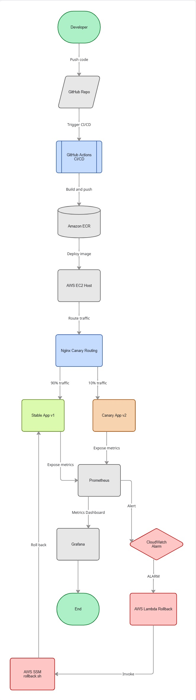
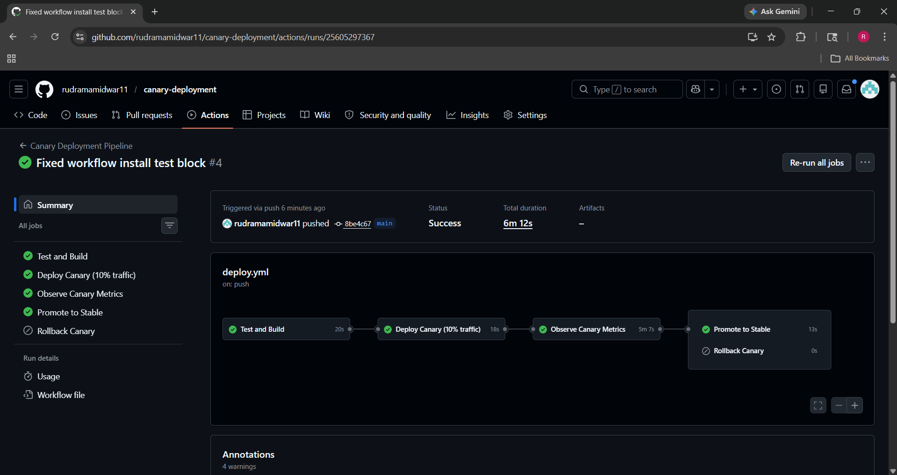
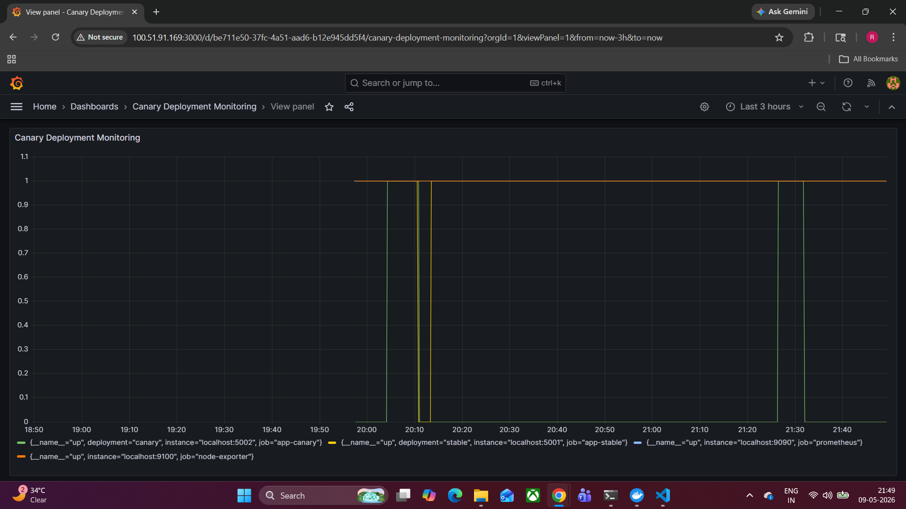
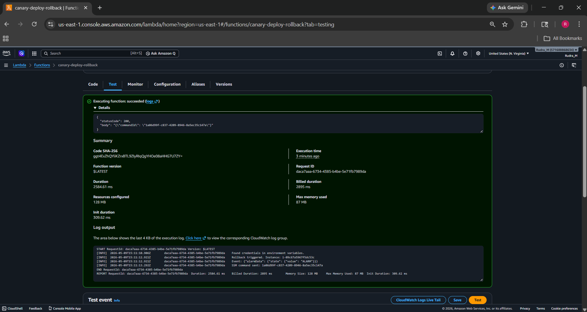

# Observability-Driven Canary Deployment Pipeline on AWS

A production-grade observability-driven canary deployment pipeline on AWS where Prometheus metrics automatically drive rollback decisions. The project uses GitHub Actions, Docker, Terraform, Prometheus, Grafana, AWS Lambda, and Nginx to implement automated CI/CD with intelligent monitoring and rollback automation.

---

## Architecture Diagram



---

## Project Workflow

Developer pushes code to GitHub → GitHub Actions builds Docker image → Image pushed to Amazon ECR → EC2 deploys Canary version → Nginx routes 10% traffic to Canary → Prometheus monitors metrics → Grafana visualizes metrics → CloudWatch + Lambda triggers rollback if failure detected.

---

## Key Features

- Canary Deployment using Nginx traffic splitting
- Automated CI/CD using GitHub Actions
- Dockerized Flask application
- Infrastructure as Code using Terraform
- Monitoring with Prometheus and Grafana
- Automated rollback using AWS Lambda + CloudWatch
- AWS Systems Manager (SSM) remote command execution
- GitHub OIDC authentication (no stored AWS keys)

---

## Tech Stack

- AWS EC2
- AWS Lambda
- AWS ECR
- AWS CloudWatch
- AWS SSM
- Terraform
- Docker
- GitHub Actions
- Nginx
- Prometheus
- Grafana
- Python Flask

---

## Screenshots

### GitHub Actions Pipeline



---

### Grafana Monitoring Dashboard



---

### Lambda Rollback Automation



---


## Architecture Flow

```text
Developer
   ↓
GitHub Repository
   ↓
GitHub Actions CI/CD
   ↓
Amazon ECR
   ↓
AWS EC2 Host
   ↓
Nginx Canary Routing
   ├── 90% → Stable App v1
   └── 10% → Canary App v2

Prometheus → Grafana
       ↓
CloudWatch Alarm
       ↓
AWS Lambda Rollback
       ↓
AWS SSM rollback.sh
```

---

## Future Improvements

- Kubernetes (EKS) based deployment
- Argo Rollouts
- Blue-Green deployment
- Slack deployment alerts
- Trivy security scanning

---

## License

This project is licensed under the MIT License.